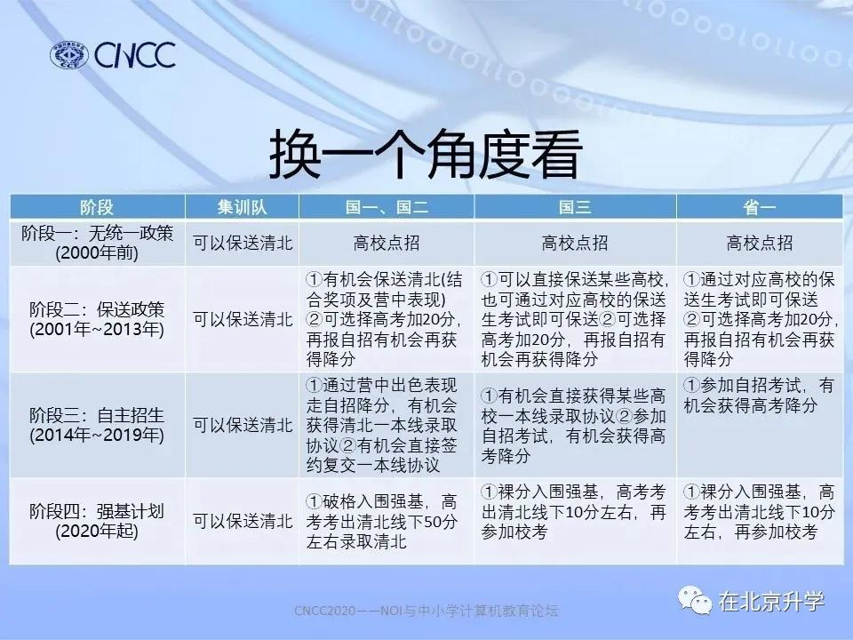
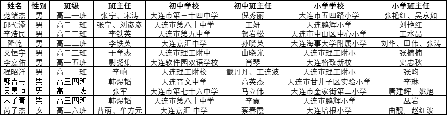

**Eason Scratch Programming**

* Scratch编程
    * 中国电子学会(CIE)：全国青少年软件编程等级考试
        * Scratch图形化编程
            * 共分4级
                * 一级：1-3年级，初步使用编程工具，编写出完整的顺序结构程序。
                * 二级：1-3年级，程序的三种基本结构，编写出能够进行交互的程序。
                * 三级：4-6年级，理解变量的概念，创建变量并处理变量中的数据。
                * 四级：4-6年级，理解列表和函数的概念，利用函数优化程序，通过函数学习算法知识。
            * 基于标准Scratch 3.0图形化编程知识能力
            * 线上报名，线上模考，线下考点考试。一年4次，3、6、9、12月。
            * 参考教材：Scratch编程入门与算法进阶（第二版） - （图形化编程考试一到四级指定教材） - ***已购***
            * 考试内容：图形化考试题型包括单选题、多选题、判断题、编程项目题。
            * 考试时间：2022年12月10-11日
            * 微信公众号：中国电子学会考评中心 - ***关注***
* C/C++编程
    * 软件
        * [Dev C++](https://www.bloodshed.net/)
    * 指法
        * [RapidTyping](https://rapidtyping.com/downloads.html)
    * 基础学科
        * 数学
            * 图解数学
            * [如何培养小学生学习数学的兴趣？](https://zhuanlan.zhihu.com/p/397936610) - 万物有数学
            * [如何提高小学一年级孩子学数学的兴趣？](https://www.zhihu.com/question/436684129)
            * [在游戏中玩转数学：有效启蒙孩子数学能力的方法大盘点](https://zhuanlan.zhihu.com/p/23807844)
    * 刷题网站汇总 https://www.zhihu.com/question/25574458
        * [LeetCode](https://leetcode.com/)
        * [AIZU Online Judge](https://judge.u-aizu.ac.jp/onlinejudge/index.jsp?lang=en)
        * [CodeForces](https://codeforces.com/)
        * https://onlinejudge.org/
        * https://www.spoj.com/
        * http://poj.org/
        * [洛谷](https://www.luogu.com.cn/)
    * 中国计算机学会（CCF）
        * [什么是信息学？NOI信息学竞赛奥赛怎么参加？](https://www.jingsailian.com/news/46154.html)
        * CNCC - NOI与中小学计算机教育论坛
        * [关于信息学竞赛与学习阶段](https://www.toutiao.com/article/6893450440621752839/)
        * [信息学竞赛介绍篇](https://zhuanlan.zhihu.com/p/389865519)
        * [入学新“捷径”？信息学奥赛，80%家长都不知道的升学秘籍！](https://www.163.com/dy/article/FVJSTP5I0536QQT6.html)
        * [信息学奥赛考什么？有什么好处？哪些人适合学？](https://www.163.com/dy/article/E4UF15R005384CSU.html)
        * 
        * [介绍 - 包括清华/北大/双一流录取签约](http://www.dlhs24.com.cn/a/deyuguanli/banzhurengongzuo/20210915/3994.html)
        * 大部分小学生涉足的还是省级的CSP-J/S考试。每年由中国计算机学会统一组织，全国统一时间、统一大纲、统一试卷进行比赛。CSP-J/S分初赛和复赛两个阶段。又分普及组和提高组两个组别，难度不同，分别对应初中和高中阶段。CSP-J/S是能力认证，任何人都可以参加CSP-J/S。在CSP-S中获得优异成绩的高中生有参加NOIP的资格，通常NOIP竞赛、NOI冬令营、NOI省队选拔三场比赛的综合加权成绩将会选拔出省队（计算方式因省而异），省队队员才有机会参加NOI全国竞赛。
        * [参赛学生切身经验](http://www.dlhs24.com.cn/a/deyuguanli/banzhurengongzuo/20220224/4137.html)
        * CSP-J（入门级，Junior）, CSP-S（提高级，Senior） - 提前2-3年准备
            * 报名时间：6月24日 - 9月8日
            * 9月初赛，形式为笔试，10月复赛，形式为机考
            * 第一轮 - 集中笔试 - 入门级 - 2022年9月18日（周日）
            * 第二轮 - 现场集中上机认证 - 提高级 - 四个题目 - 2022年10月22日（周六）
            * 辽宁 大连大学 陈寒 刘继峰 lnnoi@dlu.edu.cn 0411-82829712
            * 吉林 吉林省计算机学会 吕巍 lvwei@jlu.edu.cn - ***问问韩霄松是否认识***
            * 费用：
                * 第1轮价格统一为：50元/人（该费用不包括食宿及交通费）。
                * 第2轮提高组：480元/人（该费用不包括食宿及交通费）。
                * 第2轮提高组：260元/人（该费用不包括食宿及交通费）。
            * [NOI在线培训](https://www.noi.cn/xw/2020-05-13/715542.shtml)
            * NOI教师培训、NOI活动，参考NOI日历
            * [开发环境](https://www.noi.cn/gynoi/jsgz/2021-07-16/732450.shtml)
        * 全国青少年信息学奥林匹克联赛(简称NOIP)  - 省选级考试, 没有高三 - 全称是全国青少年信息学奥林匹克联赛，凡是由CCF认定的国内国际程序设计竞赛或能力认证中取得优秀成绩者可参加。NOIP将在每年12月的第一个星期六举行。
            * 时间：NOIP将在每年12月的第一个星期六举行。
            * 大连市第二十四中学
                * [大连24中承办2018年第六期全国信息学奥赛教师培训班](http://www.dlhs24.com.cn/a/jiaoxueyujingsai/xiaojijiaoliu/20180903/3025.html)
                * [2021大连市第二十四中学信息学奥赛又传捷报](http://www.dlhs24.com.cn/a/deyuguanli/banzhurengongzuo/list_41_4.html)
                * 第37届全国信息学奥赛总决赛 - 刘曜宁（高二五班，全国银牌，辽宁省最高分，获得强基计划破格入围资格），宋子青（高一四班，全国银牌，获得强基计划破格入围资格）
                * 大连市第二十四中学 - [张新钢](http://www.dlhs24.com.cn/a/deyuguanli/banzhurengongzuo/20210915/3994.html)
                * 信息学竞赛小组 DL240I
                * CSP-J/S2019第一轮定级规则为：全国一等级认证基准分数线为70分，二等级认证基准分数线为50分，三等级认证基准分数线为30分。
                * 袁小迪同学拿到北京大学降60分录取和前一百名一本线录取资格协议，曹依林同学拿到北京大学一本线录取协议，王子恒同学拿到中国人民大学降60分录取协议，高二司嘉祺同学拿到了北京大学一等录
                * NOI培训基地：  大连市第二十四中学（辽宁）、华东师范大学第二附属中学（上海）、  长沙市雅礼中学（湖南）、南京外国语学校（江苏）、绍兴市第一中学（浙江）、北京市第八十中学（北京）、中山市中山纪念中学（广东）这七所全国名校将共享教学资源，联合开展学生培训、教师培训、模拟竞赛、编程演练等一系列工作。
    取协议。    
                * 二年八班曹依林同学获得北京大学无条件降一本线录取资格，二年七班袁小迪同学获得北大无条件降60分录取和前一百名一本线录取资格。
                * 大连市第二十四中学信息学奥林匹克竞赛共获得：全国金牌2枚、全国银牌5枚、全国铜牌15枚、省级一等奖66人次，省级二等奖160人次。24中人会一路前行，续写新的辉煌。
                * 本学科竞赛从2011年至今总成绩一直连续在辽宁省排名第一！
                * 2016 高一四班邱元辰获得银牌，高二五班徐德嘉取得北京大学无条件降60分政策；高二三班郑泽晖获得铜牌签浙江大学一本线；高二一班褚逸豪、李一凡、高二二班杜世航获铜牌，分别获得哈工大，天津大学和大连理工大学等高校的A类自主招生资格(直接面试降一本线)。    
            * 大连育明高级中学 2018 1人
            * 大连市实验学校
            * 大连市第八十中学 - 初二
            * 大连市育文中学 - 初二
            * 大连市第一中学
            * 大连市第二十三中学
            * 大连市第十三中学
            * 大连市第八中学
            * 
        * 全国信息奥赛（NOI） 全国级比赛，NOI是全国青少年信息学奥林匹克竞赛，是面向中学生的全国性质的编程最高级别比赛。
        * 国际信息奥赛（IOI） IOI是国际信息学奥林匹克竞赛，是面向全世界中学生的一年一度的信息学学科竞赛，每个国家最多可选派4名选手参加。
        * ACM，国际级大学生比赛 - 主要是指ACM-ICPC，即国际大学生程序设计竞赛，包括全球总决赛和各大洲的区域赛。

**Richard Programming Learning**

**Eason Programming Learning**

* [经验：CSP-J/S初赛核心知识点整理](https://m.wang1314.com/doc/webapp/topic/21550402.html)
* [csp-j/s考试内容](https://xue.baidu.com/okam/pages/strategy-tp/index?strategyId=137776310882246&source=natural)
* [CSP-J涉及哪些知识点？](https://www.zhihu.com/question/480043582)
* [CSP-J/S第一轮测试知识点全覆盖](https://blog.csdn.net/qq_32431299/article/details/124959136)
* 

---

**大连高中列表**

大连市第一中学
大连市第二中学
大连市第三中学
大连市第五中学（隶属于西岗区教育局，完全中学）
大连市第八中学（校舍原为大连霞小学校所用）
大连市第十一中学
大连市第十二中学
大连市第十三中学（隶属于沙河口区教育局，曾经为完全中学，2011年已无初中）
大连市第十五中学（美术特色学校，完全中学）
大连市第十六中学（完全中学）
大连市第二十高级中学
大连市第二十三中学
大连市第二十四中学
大连市第二十五中学
大连市第三十六中学
大连市第四十四中学（完全中学）
大连市第四十八中学
辽宁师范大学附属中学（隶属于辽宁师范大学）
大连理工大学附属高中（隶属于大连理工大学）
大连育明高级中学
大连红旗高级中学
大连市金州高级中学
大连市一〇二中学
大连市一〇三中学
大连市一〇八中学
大连经济技术开发区第一中学
大连经济技术开发区第八中学
大连经济技术开发区第十中学
大连经济技术开发区得胜高级中学
大连保税区第一中学
大连海湾高级中学
大连教育学院附属高中
大连新世纪高级中学
大连枫叶国际学校
北京语言大学附属大连高中

---

**CSP-JS第一轮认证工作流程**

|日期|时间|内容|角色|
|-|-|-|-|
|6月17日- 9月7日|全天|网站注册、审核|教师、认证组织单位总负责人|
|6月24日-9月8日|9月8日15:00前|网站注册、报名、审核|认证者、教师、认证组织单位总负责人|
|6月30日-9月10日|全天|认证者状态为“等待CCF管理员审核”后，在报名页面进行最终确认（交费）|认证者（最终确认报名后，审核状态不会改变）|
|9月12日|9:00-16:00|生成准考证号、提交报名表、上传考点信息、CCF审核报名表|认证组织单位总负责人、CCF管理员|
|9月13日-15日|全天|在报名系统内上传考点信息|认证组织单位总负责人|
|9月15日-18日|全天|下载准考证|认证者|
|9月18日|9:30-11:30|CSP-J入门级第一轮认证|入门级认证者|
|9月18日|14:30-16:30|CSP-S提高级第一轮认证|提高级认证者|
|9月26日|全天|公布第一轮认证成绩|认证组织单位总负责人|

---

**NOI2022辽宁省队入选名单公示**

|姓名|学校|性别|年级|NOIP2021成绩|省选成绩|加权总分|省队类别(备注1/3限制)|
|-|-|-|-|-|-|-|-|
|张文哲|辽宁省实验中学|男|高二|328|330|1000|A|
|范绪杰|大连市第二十四中学|男|高二|232|280|806.1|A|
|李嘉佑|大连市第二十四中学|男|高一|230|280|804.3|A|
|苏泓燃|大连市第二十四中学|男|高一|135|245|643.2|A|
|李南锡|东北育才学校|男|高二|160|180|528.2|B|
|董佳一|辽宁省实验中学分校|男|高一|190|165|523.8|B|
|于士博|本溪市高级中学|男|高二|201|155|512.6|B|
|芮子杰|大连市第二十四中学|女|高二|132|80|290.4|A|

---

**Scratch考试通知**

重要提醒：请新用户注册验证时上传照相馆拍摄的标准大2寸蓝底或红底照片。

关于2022年9月青少年等级考试的几点说明：

一、考试方式：在线居家考试（全国），不允许在培训机构考试及任何形式的聚集性考试。

二、关于聚集性考试的定义：未经向中国电子学会考评中心申请批准，在非考生日常家庭生活环境下出现同一地址、同一考试时段2名以上考生同时参加考试的情况。

说明：如有因考生家庭环境不符合考试条件、考生家长或监护人无法完成要求相关考试监护工作的，请勿参加本次考试，已经报名的考生请及时办理退费。请勿听信任何机构或个人宣传，违反考试规定参加考试，以免造成不必要的损失。

三、报名时间：2022年7月7日-9月6日16:00，考生注册、登录后填报信息并完成缴费视为报名成功。

注意事项： 

1. 报名结束前，考生因个人原因可申请退考，全额退费。
2. 报名结束后，因已启动考务组织程序、安排考试资源，不予退费。
3. 未参加考试的，视为缺考，不予退费。

四、准考证下载：9月12日-考前1天

五、考前集中测试

1. 时间：9月15日（周四）19:00-21:00 

    专业：软件编程（C语言）、软件编程（图形化）、软件编程（Python）

2. 时间：9月22日（周四）19:00-21:00

    专业：机器人技术

六、线上居家考试必备软硬件环境（考生）

（一） 考生电脑

    操作系统windows 7或10版本， 4G以上内存，C盘（或系统盘）有4G以上剩余硬盘空间。

    电脑应配有摄像头、音箱或耳机、麦克风。

    建议使用含摄像头的笔记本电脑+耳麦。

（二）浏览器

    考试应使用谷歌Chorme浏览器80以上版本。

    下载地址：https://www.google.cn/chrome/

（三） 实操器材

    考生应自备对应等级的考试器材，建议使用经学会测试合格的考试器材。

    推荐器材网址：http://www.kpcb.org.cn/h-col-110.html

（四）网络配置

    具有稳定的宽带网络，速率应不低于20Mbps。

    考试期间请避免在同一网络中下载文件、看电视、玩游戏。

    建议通过www.speedtest.cn等网站测试网速。

（五） 辅助设备

    须准备一台可上网的智能手机或平板电脑（含摄像头并安装钉钉），作为监控使用。

（六） 环境检测

    考前集中进行考生电脑环境检测，具体测试时间将通过以下公众号及时推送，请各位家长关注。