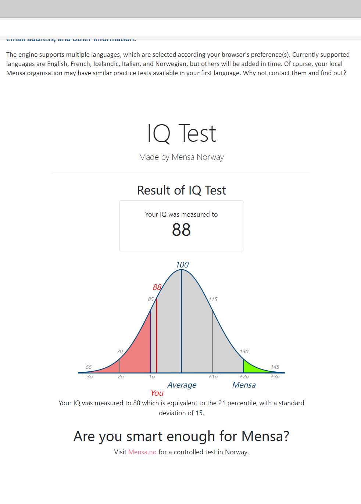

[What Does STEM Stand For? True STEM Meaning & Importance](https://www.codewizardshq.com/stem-meaning/)

[Elementary School (Ages 8-10)](https://www.codewizardshq.com/elementary-school-coding-program/)
* Kids Start to Code With Scratch
* From Block-Based Code to Real World Programming

Classes
* Level 1
    * Animation and Games with Scratch
    * Logic with Scratch
    * Intro to Text-based Programming
* Level 2
    * Programming Fundamentals with Python
    * Logic with Python
    * Modular Programming with Python
* Level 3
    * Creating Websites with HTML/CSS
    * Responsive Websites with HTML/CSS
    * Interactive Websites with JavaScript

[Middle School (Ages 11-13)](https://www.codewizardshq.com/middle-school-coding-program/)
* Students Start Programming with Python
* Learn to Build Interactive Websites

Classes
* Level 1
    * Intro to Programming with Python
    * Beyond Basics with Python
    * Webpages with HTML & CSS
* Level 2
    * Responsive Web Development
    * Interactive JavaScript
    * Web Interfaces
* Level 3
    * Intro to Databases
    * Mastering APIs
    * Mastering Databases

[High School (Ages 14-18)](https://www.codewizardshq.com/coding-classes-high-school-students/)
* Start With Python in High School
* Real World High School Coding Internship

Classes
* Level 1
    * Intro to Python
    * Fundamentals of Web Development
    * User Interface Development
* Level 2
    * APIs and Databases
    * Professional Web App Development
    * Modern CSS Framework
* Level 3
    * Mastering MVC Framework
    * Object Relational Mapping
    * DevOps and Software Engineering

Scatch Learning Resources
* [Curriculum Connections with Scratch](https://sip.scratch.mit.edu/themes/curriculum/)
* [Machine Learning for Kids](https://machinelearningforkids.co.uk/?linkId=132009182#!/about)
* [Code.org](https://code.org/)
* [Code Club](https://projects.raspberrypi.org/en/codeclub/)

Create and share your work on [Scratch Programming](https://scratch.mit.edu/).

China Scratch sharing community [https://www.scratch-cn.cn/](https://www.scratch-cn.cn/)

Game Development https://www.evkworld.cn/](https://www.evkworld.cn/)

https://gitee.com/scratch-cn/lite

https://www.mindplus.top/

---

