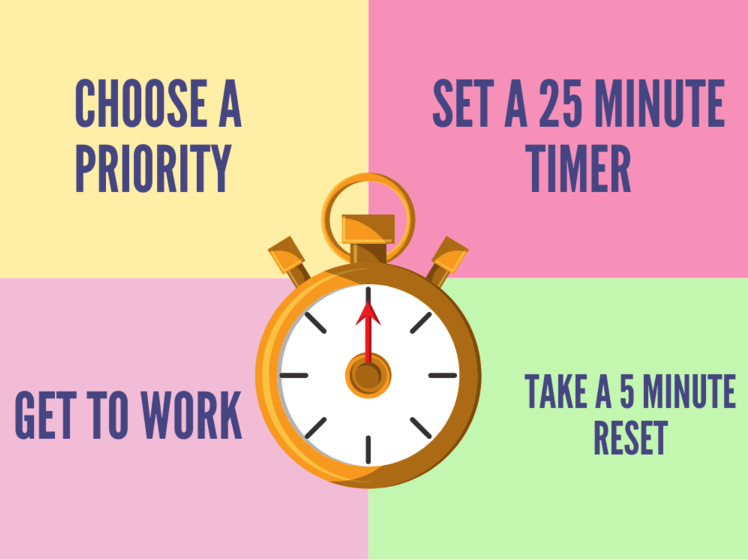

**POMODORO GUIDANCE**

What is the Pomodoro technique? A method for staying focused and mentally fresh and a simple method to balance focus with deliverate breaks.

* STEP 1 - Plan and decide your tasks need to complete and estimate how many pomodoros might you need?
* STEP 2 - Pick a task, do 1 Pomodoro
* STEP 3 - Set a 25-minute timer (focused work, protect your pomodoro!)
* STEP 4 - Work on your task until the time is up
* STEP 5 - Take a 5 minute break (no sneaky working)
* STEP 6 - Repeat 4 Pomodoros then take a longer 15-30 minute break

<iframe width="560" height="315" src="https://www.youtube.com/embed/mNBmG24djoY" title="YouTube video player" frameborder="0" allow="accelerometer; autoplay; clipboard-write; encrypted-media; gyroscope; picture-in-picture" allowfullscreen></iframe>

**Monotasking**

**Get Things Done**