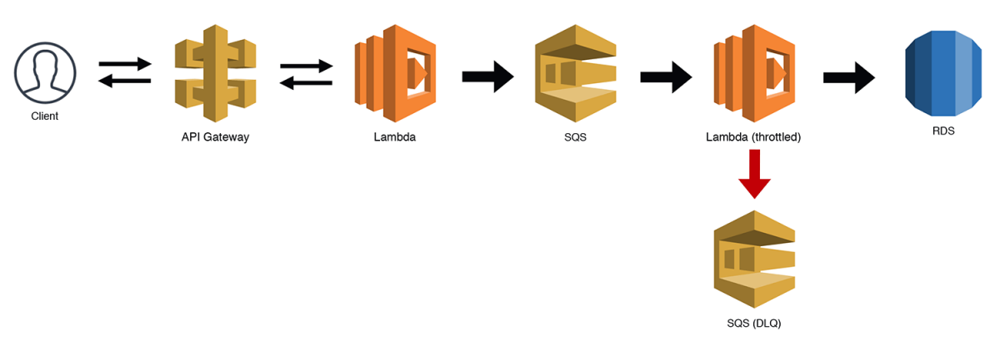
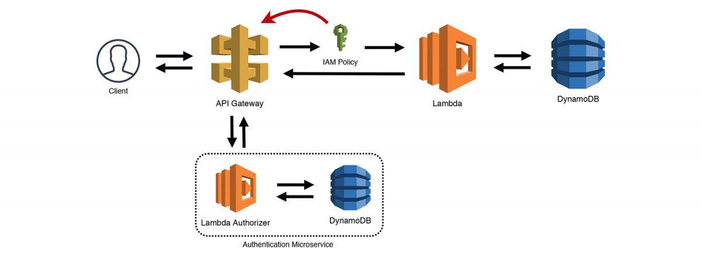
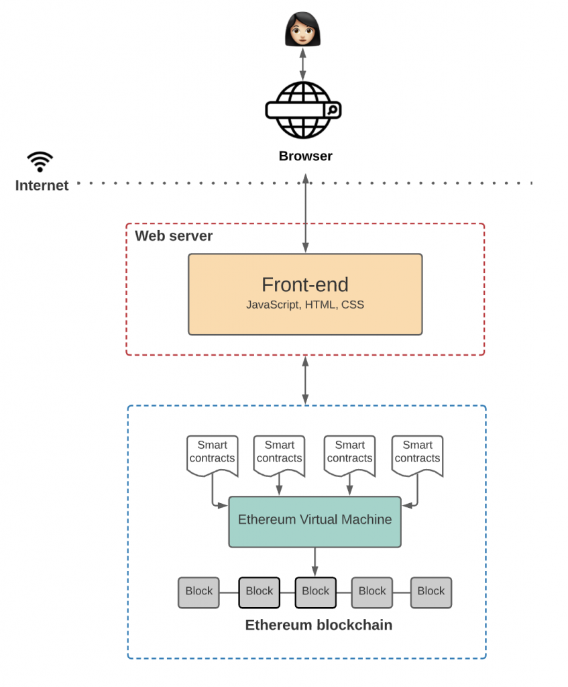
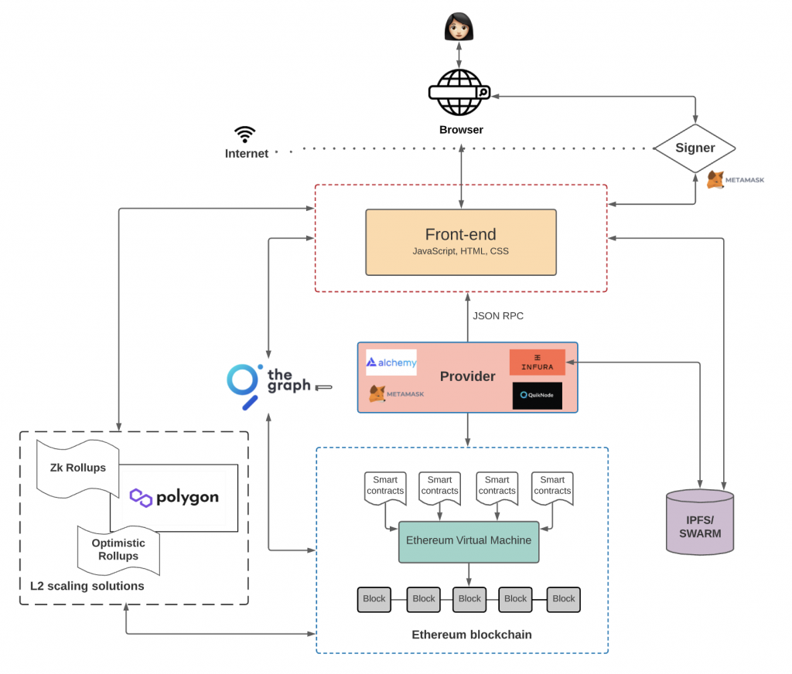

* Promise
* Architecture
* Sustainability
* Blockchain
* IoT
* AI
* Big Data
* Install Switch Theme
* Adriuno
* Rasberry Pi
* Dataflow
* Composer
* BigQuery
* PostgreSQL CDC
* DynamoDB Stream
* Web 3D
* Metaverse
* Living Documentation
* Redirect to short URL link - 

---
## CloudFront & Lambda@edge - ***`In Progress with Further Questions`***

* 问题：Lambda@Edge为什么不写日志? 跟Edge Location有关
* 问题：什么是Cloud Function跟Lambda@Edge有什么区别？
* 问题：CloudFront Behavior的处理流程

* [Using Amazon Lambda with CloudFront Lambda@Edge](https://docs.amazonaws.cn/en_us/lambda/latest/dg/lambda-edge.html)
* [Deploy Lambda@Edge function to CloudFront](https://catalog.us-east-1.prod.workshops.aws/workshops/a2dad93e-1e9f-4459-91ff-c69c7db376dd/en-US/deploy-lambda-edge-function-to-cloudfront)
* [Migrating from Lambda@Edge to CloudFront Functions](https://dev.to/aws-builders/migrating-from-lambda-edge-to-cloudfront-functions-3k7k)
* [Cloudfront Functions and Lambda@Edge Compared](https://www.sentiatechblog.com/cloudfront-functions-and-lambda-edge-compared)
* [CloudFront Functions vs. Lambda@Edge — Which One Should You Choose?](https://medium.com/trackit/cloudfront-functions-vs-lambda-edge-which-one-should-you-choose-c88527647695)
* [Authorization@Edge – How to Use Lambda@Edge and JSON Web Tokens to Enhance Web Application Security](https://aws.amazon.com/cn/blogs/networking-and-content-delivery/authorizationedge-how-to-use-lambdaedge-and-json-web-tokens-to-enhance-web-application-security/)
* [AWS / CDN / CloudFront / Authentication Using Lambda Function](https://learn.openwaterfoundation.org/owf-learn-aws/cdn/cloudfront/private-auth-lambda/)
* [Secure Your Static Website with AWS CloudFront and Lambda](https://vthub.medium.com/lambda-edge-and-jwt-authentication-to-protect-sensitive-components-of-your-reactjs-app-901e0c10fd35)


* [如何配置 CloudFront 以将授权标头转发至源？](https://aws.amazon.com/premiumsupport/knowledge-center/cloudfront-authorization-header/)
* [Basic HTTP Authentication for CloudFront with Lambda@Edge · GitHub](https://gist.github.com/lmakarov/e5984ec16a76548ff2b278c06027f1a4)

```JavaScript
'use strict';
exports.handler = (event, context, callback) => {
   // Get request and request headers
    const request = event.Records[0].cf.request;
    const headers = request.headers;
    
    const response = {
        status: '200',
        statusDescription: 'OK',
        headers: {
            'cache-control': [{
                key: 'Cache-Control',
                value: 'max-age=100'
            }],
            'content-type': [{
                key: 'Content-Type',
                value: 'text/html'
            }]
        },
        body: ':' + headers.authorization[0].value + ':' + headers.Authorization + ':' + headers["authorization"] + ':' + headers["Authorization"] + ':',
    };
   // Continue request processing if authentication passed
    callback(null, response);
};
```

---

## SPH - ***`In Progress`***

* Sensitive Data Process
    * GLR
    * DPIA - Data Privacy Information Assessment?
* Data Fabric Process
* Data Lake Process
* Power BI Process

* ARB Items


* 110556(Sustainable Procurement Hub) is the Application name
* Project Name should be True Supplier Marketplace (TSM)

### SPH Microservices Design - ***`In Progress`***

* Public API
* The BFF Pattern (Backend for Frontend)
    * With GraphQL, AWS Cognito, AppSync, Aurora Serverless and Pulumi Automation
    * AWS Step Function
    * GraphQL
* Database
    * Aurora Serverless
* GDPR/AVG Handling

* [Serverless Microservice Patterns for AWS](https://www.jeremydaly.com/serverless-microservice-patterns-for-aws/)
* [Serverless Reference Architectures](https://www.jeremydaly.com/serverless-reference-architectures/?utm_source=patterns-post)





---
##  Web 3.0 (Web3) - ***`Completed`***

* [Web 3.0 (Web3)](https://www.techtarget.com/whatis/definition/Web-30)
    * Foundation layer: HTML/CSS/JavaScript
    * How it connect to data sources
    * Where those data sources reside
* [Web3 Architecture and How It Compares to Traditional Web Apps](https://thenewstack.io/web3-architecture-and-how-it-compares-to-traditional-web-apps/)
    * Dapps - decentralized applications
    * Smart contracts are written in high-level languages, such as **`Solidity`** or **`Vyper`**.
    
    * a decentralized off-chain storage solution, like IPFS or Swarm.
    
* [The Architecture of a Web 3.0 application](https://www.preethikasireddy.com/post/the-architecture-of-a-web-3-0-application) - `★★★★★`
    * decentralized state machine
    * There are two ways to broadcast a new transaction:
        * Set up your own node which runs the Ethereum blockchain software
        * Use nodes provided by third-party services like Infura, Alchemy, and Quicknode
* A Dapp product - https://www.manyver.se/
* Things need to learn
    * Ethereum blockchain
    * Smart contracts language: Solidity, Vyper
    * Ethereum Virtual Machine (EVM)
    * How to Set up your own node which runs the Ethereum blockchain software
    * How to Use nodes provided by third-party services like Infura, Alchemy, and Quicknode
    * Every Ethereum client (i.e. provider) implements a JSON-RPC specification.
    * This “signing” of transactions is where Metamask typically comes in.
    * One way to combat this is to use a decentralized off-chain storage solution, like IPFS or Swarm.
    * The Graph is an off-chain indexing solution that makes it easier to query data on the Ethereum blockchain. 
    * One popular scaling solution is Polygon, an L2 scaling solution.
    * Other examples of L2 solutions are Optimistic Rollups and zkRollups.
    * For instance, Hardhat is a developer framework that makes it easier for Ethereum developers to build, deploy, and test their smart contracts.
---

## Completion List

## 2022/10/03

* [Building a Web App with Angular and Bootstrap](https://buddy.works/tutorials/building-a-web-app-with-angular-and-bootstrap)
* [Automate static website deployment from Github to S3 using AWS CodePipeline](https://medium.com/avmconsulting-blog/automate-static-website-deployment-from-github-to-s3-using-aws-codepipeline-16acca25ebc1)
* Redirect to short URL link - ***`Completed`***
* Issue {"message":"Missing Authentication Token"}
* S3 - ***`Completed`***
    * Clear 'Block all public access' checkbox
    * Enable 'static website hosting'
    * Policy
    ```JSON
    {
        "Version": "2012-10-17",
        "Statement": [
            {
                "Sid": "PublicReadGetObject",
                "Effect": "Allow",
                "Principal": "*",
                "Action": [
                    "s3:GetObject"
                ],
                "Resource": [
                    "arn:aws:s3:::Bucket-Name/*"
                ]
            }
        ]
    }
    ```
    * Verify S3 static web hosting URL
* Route53
    * Register custom domain
    * Create hosted zone
* CloudFront
    * Create distribution
    * Verify with CloudFront URL
    * Select 'Origin access control settings (recommended)'
    * Create control setting
    * Copy policy
    ```JSON
    {
        "Version": "2008-10-17",
        "Id": "PolicyForCloudFrontPrivateContent",
        "Statement": [
            {
                "Sid": "AllowCloudFrontServicePrincipal",
                "Effect": "Allow",
                "Principal": {
                    "Service": "cloudfront.amazonaws.com"
                },
                "Action": "s3:GetObject",
                "Resource": "arn:aws:s3:::cuichikun.com/*",
                "Condition": {
                    "StringEquals": {
                      "AWS:SourceArn": "arn:aws:cloudfront::058566749128:distribution/EQAM99V1XFRTS"
                    }
                }
            }
        ]
      }
    ```
* Certificate Manager
    * Request a public certificate
    * Create records in Route53
    * Verify certificate issued

## 2022/10/02

* Publish Github pages - ***`Completed`***
* Remove useless AWS resources - ***`Completed`***
* Create VPC - ***`Completed`***
    * VPC - Your AWS virtual network
        * richardcuick-vpc
    * Subnets - Subnets within this VPC
        * us-east-1a
            * richardcuick-subnet-public1-us-east-1a
            * richardcuick-subnet-private1-us-east-1a
        * us-east-1b
            * richardcuick-subnet-public2-us-east-1b
            * richardcuick-subnet-private2-us-east-1b
    * Route tables - Route network traffic to resources
        * richardcuick-rtb-public
        * richardcuick-rtb-private1-us-east-1a
        * richardcuick-rtb-private2-us-east-1b
    * Network connections - Connections to other networks
        * richardcuick-igw
        * richardcuick-vpce-s3
* Find minimal JavaScript development environment - ***`Completed`***
    ```
    node index.js
    ```
* Convert tiny URL C++ code to JavaScript - ***`Completed`***
    * [How to design a tiny URL or URL shortener?](https://www.geeksforgeeks.org/how-to-design-a-tiny-url-or-url-shortener/)
* Create shortUrl DynamoDB table - ***`Completed`***

### 2022/10/01

* Create first Github Gist - ***`Completed`***
* Create Github Profile repository - ***`Completed`***

### 2022/09/30

* 将richardcuick.github.io代码库迁移到@richardcuick1目录 - ***`Completed`***
* Switch游戏安装 - ***`Completed`***
    * 安装游戏：星之卡比、宝可梦剑盾
    * Awoo Installer v1.3.6
    * 大气层的最优先选择是NSP本体+UPD+DLC，而不是XCI整合包
* 创建@richardcuick1目录 - ***`Completed`***